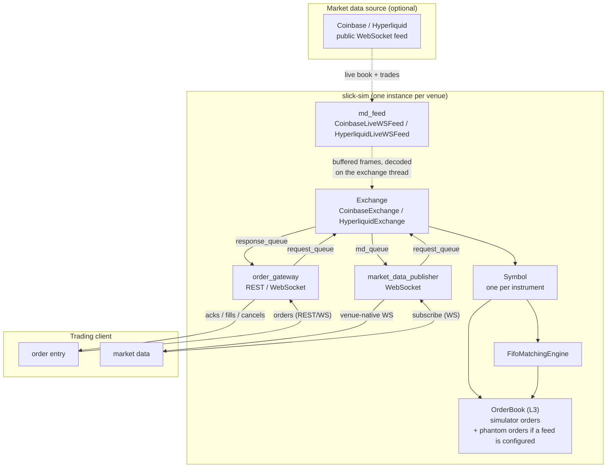
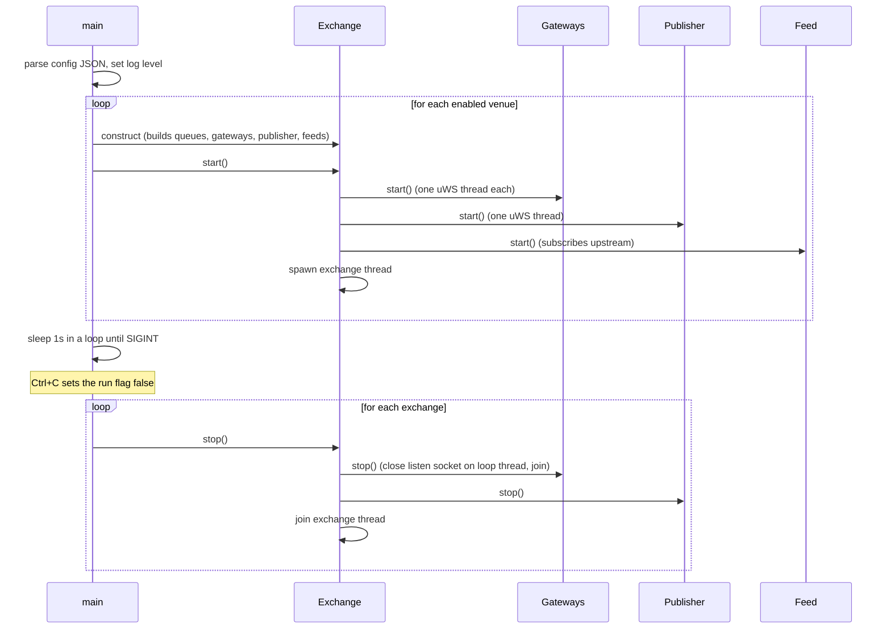

# Architecture

## Operating modes

The market-data feed is **optional**, and what you configure under `md_feeds` decides what kind of
simulator you get. The rest of the system — gateways, order book, matching engine, publisher — is
identical in every case; only the source of the resting liquidity changes.

| Mode | `md_feeds` | Liquidity in the book | Status |
| --- | --- | --- | --- |
| **Shadowing** | A live feed (`coinbase_live_ws` / `hyperliquid_live_ws`) | Real venue quotes, mirrored continuously | Implemented |
| **Self-contained** | Omitted, or no recognised `type` | Only the orders clients send | Implemented |
| **Historical replay** | A historical feed | Recorded market data, replayed | **Not implemented** |

### Shadowing — matching against the live market

The mode `slick-sim` is built for. It subscribes to the **real venue's live public market data** and
reconstructs that venue's book locally, order by order. Your orders are inserted into that same book
and matched against real, currently-quoted liquidity by a local FIFO engine.

Prices and trades are therefore real; fills are simulated. Nothing is ever sent upstream except
market-data subscriptions and — for Hyperliquid — read-only `/info` metadata queries.

### Self-contained — a conventional exchange simulator

With no feed configured, the same machinery behaves like a conventional exchange simulator: books
start empty and the only liquidity is what clients themselves submit. Orders rest, match against each
other under the same FIFO price/time priority, and produce the same execution reports and
venue-native market data. Useful for deterministic tests, for exercising a client's order-entry path
without depending on the internet, and for multi-client scenarios where you want full control over
both sides of every trade.

Both adapters gate this on an internal `use_live_feed_` flag, set only when `md_feeds` contains an
entry whose `type` the adapter recognises. Omit `md_feeds` entirely, or give it an unrecognised
`type`, and the flag stays false.

!!! note "You still need a market-data subscription to trade a symbol"
    `Symbol` objects are created lazily by `handleMdSubscription`, and that is the only path that
    creates them. Even in self-contained mode a client must subscribe to the symbol's market data
    before sending orders for it, or they are rejected with `UNKNOWN_CONTRACT`. The subscription
    simply returns an empty book instead of a live snapshot.

### Historical replay — planned

A historical feed would implement the same `MDFeed` interface and drive the book from recorded data
rather than a live socket, so clients' orders match against a past market at whatever rate the replay
runs. Everything downstream is unchanged: the same phantom-order model, the same matching engine, the
same venue-native output.

Nothing implements this yet — `alpaca_historical_data_feed.hpp` is a zero-byte placeholder and
`md_feed`'s `CMakeLists.txt` compiles only the Hyperliquid live feed. See
[Known gaps](known-gaps.md#the-historical-data-feed-does-not-exist) and, for what a feed has to
provide, [Adding an exchange](extending.md#3-implement-the-feed-optional).

## Phantom orders and simulator orders

Whenever a feed *is* driving the book — live today, historical later — the book holds two kinds of
liquidity:

- **Phantom orders** — synthesised from the market-data feed to represent the market's resting
  liquidity. They are anonymous: the simulator knows their price, quantity and queue position, but
  nothing else.
- **Simulator orders** — the orders your client actually sent. They rest in the same book, at the same
  price levels, competing for the same queue positions.

The book cannot distinguish them structurally; it distinguishes them by bookkeeping. This split is
the single most important idea in the codebase and is covered in detail in
[Order book](order-book.md).

In self-contained mode the book simply contains no phantom orders. Nothing else changes — the same
code paths run, `feed_md_level_quantity_` stays empty, and every fill comes from one client order
crossing another.

## The per-exchange pipeline

Every enabled venue gets its own complete, independent instance of this pipeline. Two venues share
nothing except the `SymbolManager` singleton and the process-global order-id and priority counters.

The dashed portion is the market-data source, which is optional — without it the pipeline runs
unchanged and the book holds only client orders.



The two client-facing paths are fully independent, and each is bidirectional:

- **Order entry** — `order_gateway` accepts orders from the client and returns acks, fills, cancels
  and rejects to that same client, over the same connection.
- **Market data** — `market_data_publisher` accepts `subscribe`/`unsubscribe` messages from the client
  and streams book and trade updates back.

A client's **subscription request never touches `order_gateway`**. The publisher receives it on its
own WebSocket and writes an `MD_SUBSCRIPTION` `Request` onto `request_queue_` itself — so the
publisher is a producer for that queue exactly as the gateways are, and `Exchange::processRequest`
sees order requests and subscription requests interleaved on one queue.

## Library targets

The build produces one executable, `slick-sim`, from
[`src/sim/main.cpp`](https://github.com/SlickQuant/slick-sim/blob/main/src/sim/main.cpp),
linked against a handful of static libraries.

| Target | Directory | Responsibility |
| --- | --- | --- |
| `exchange` | `src/exchange/` | Per-venue orchestration (`Exchange`, `CoinbaseExchange`, `HyperliquidExchange`) and `Symbol`, which binds one instrument's book to a matching engine |
| `matching_engine` | `src/matching_engine/` | `MatchingEngine` interface, `FifoMatchingEngine`, and the four order-lifecycle publish helpers |
| `order_gateway` | `src/order_gateway/` | Venue-native REST/WebSocket order entry, plus the unused generic TCP/FIX/SBE gateway |
| `market_data_publisher` | `src/market_data_publisher/` | Re-encodes internal market data into each venue's own WebSocket format |
| `md_feed` | `src/md_feed/` | Live market-data ingestion from the real venue |
| *(header-only)* | `src/common/`, `src/order_book/`, `src/utils/` | Shared types, the order book, and small helpers — no compiled target, included directly |

## Threading model

This is the part most likely to trip you up, because it is not what the class structure suggests.

### Threads per exchange

**One exchange thread.** Created in the concrete adapter's `start()`, it runs a tight spin loop that
does all book mutation and all order processing:

```cpp
// CoinbaseExchange::start()
thread_ = std::thread([this]() {
    while (run_.load(std::memory_order_relaxed)) {
        if (md_feed_ || !md_feeds_.empty()) {
            processData();            // drain the WS stream multiplexer
        }
        processSequencedEvents();     // release time-ordered book events
        processRequest();             // one order request per iteration
    }
});
```

`HyperliquidExchange` is the same shape with `drainEventQueue()` in place of the first two calls.
Note there is no sleep and no condition variable — the thread spins at 100% of a core by design.

!!! warning "The base class does not loop"
    `Exchange::start()` calls `processRequest()` exactly once, with no loop. Only the two concrete
    adapters override it correctly, so a config key other than `coinbase` or `hyperliquid` yields an
    exchange that binds no ports and processes at most one request. See
    [Known gaps](known-gaps.md#an-enabled-venue-key-with-no-adapter-starts-but-does-nothing).

**One uWebSockets event-loop thread per gateway and per publisher.** `RestWsOrderGateway::start()`
and `WebsocketMarketDataPublisher::start()` each spawn a thread that builds a `uWS::App`, installs
routes, and calls `.run()`. For Coinbase that is three such threads (REST gateway, WS gateway, MD
publisher); for Hyperliquid, two.

**Venue-SDK WebSocket threads.** Both client libraries run their own network thread, but neither one
invokes our callbacks from it. Each is configured for **user-thread dispatch**: the network thread
only parks raw frames in a buffer, and the callbacks fire on whichever thread later drains that
buffer — which here is always the exchange thread.

- **Coinbase** — `CoinbaseExchange` implements `coinbase::UserThreadWebsocketCallbacks`, and the WS
  client writes into a `slick::stream_buffer_multiplexer`. The exchange loop calls
  `processData()`, which decodes the buffered frames and invokes `onLevel2Updates`,
  `onMarketTrades`, `onLevel2Snapshot` and the rest **inline, on the exchange thread**.
- **Hyperliquid** — `HyperliquidLiveWSFeed` constructs `hyperliquid::Info` with
  `user_thread_dispatch = true` ("*if true, callbacks fire on dispatch() caller thread*"). The
  exchange loop calls `getInfo()->dispatch(100)` from `drainEventQueue()`, so `onL2BookUpdate` and
  `onTradesUpdate` likewise run **on the exchange thread**.

The upshot is that a single thread per venue decodes market data, mutates the book, matches orders,
and publishes — no locking is needed anywhere in that path.

### Which thread runs what

| Code | Thread | Notes |
| --- | --- | --- |
| `Exchange::processRequest`, `handleNewOrderRequest`, `Symbol::addOrder`, `FifoMatchingEngine::match`, all `publish*` | Exchange thread | The only thread that mutates an `OrderBook` |
| `CoinbaseExchange::onLevel2Updates`, `onMarketTrades` | **Exchange thread**, via `processData()` | Push `Event`s into the per-symbol priority queue for time-ordering |
| `CoinbaseExchange::onLevel2Snapshot` | **Exchange thread**, via `processData()` | Mutates the book directly, bypassing the priority queue |
| `HyperliquidExchange::onL2BookUpdate`, `onTradesUpdate` | **Exchange thread**, via `dispatch()` | Append to `event_queue_`, processed later in the same `drainEventQueue()` call |
| `HyperliquidExchange::processL2Snapshot`, `processL2Diff` | Exchange thread | Drained from `event_queue_` by `drainEventQueue()` |
| Venue-SDK network threads | Their own threads | Receive bytes into the buffer only — never enter our code |
| REST route handlers, WS message handlers | That gateway's uWS loop thread | Write to `request_queue`, poll `response_queue` |
| `CoinbasePublisher::publish_*`, `HyperliquidPublisher::publish_*` | Publisher's uWS loop thread | Read `md_queue`, write to client sockets |
| `CoinbasePublisher::handle_message`, `HyperliquidPublisher::handle_message` | Publisher's uWS loop thread | Client `subscribe`/`unsubscribe` — writes `MD_SUBSCRIPTION` to `request_queue` |

The gateway threads deserve a closer look. `POST /api/v3/brokerage/orders` publishes a request and
then **blocks its uWS loop thread**, polling `response_queue` every 100 µs for up to 5 seconds waiting
for the matching engine's reply. That is a synchronous request/response bridge across a lock-free
queue, and while it is waiting, that gateway's event loop serves no other client. Cancel and edit use
the same pattern with a 200 ms timeout.

## Queue topology

Three `slick::queue` instances per exchange, constructed in the
[`Exchange` constructor](https://github.com/SlickQuant/slick-sim/blob/main/src/exchange/exchange.cpp#L17-L32):

```cpp
request_queue_ (config.value("request_queue_size",  1048576), …)
response_queue_(config.value("response_queue_size", 1048576), …)
md_queue_      (config.value("md_queue_size",   16777216), …)
```

| Queue | Element | Producers | Consumer |
| --- | --- | --- | --- |
| `request_queue_` | `Request` | Every order gateway, and the market-data publisher (for subscriptions) | Exchange thread |
| `response_queue_` | `OrderResponse` | Exchange thread (via matching-engine publish helpers and the reject/pending senders) | Every order gateway |
| `md_queue_` | `uint8_t` (variable-length frames) | Exchange thread | Market-data publisher |

`md_queue_` is a byte queue rather than a typed one because market-data messages are
variable-length. Producers call `reserve(size)` to get a slot index, cast the returned pointer to
`MarketDataUpdate*`, fill the trailing flexible-array payload, then `publish(index, size)`. See
[Market data](market-data.md#the-internal-market-data-wire-format).

Consumers hold their own cursor and call `read(cursor)`; each consumer advances independently, so a
response queue with several gateways attached delivers every response to every gateway, and each one
filters by `user_id`.

### Shared-memory queues

Each queue also accepts an optional shared-memory name:

```json
"request_queue_shm_name":  "slick_sim_coinbase_req",
"response_queue_shm_name": "slick_sim_coinbase_rsp",
"md_queue_shm_name":       "slick_sim_coinbase_md"
```

When present, `slick::queue` backs the ring with a named shared-memory segment instead of process
memory, which would let an external process attach to the same queue. These keys are read by the
`Exchange` constructor but appear nowhere in the sample config and are not otherwise exercised.

## Symbol management

[`SymbolManager`](https://github.com/SlickQuant/slick-sim/blob/main/src/common/symbol_manager.hpp)
is a **process-wide singleton**, not per-exchange:

```cpp
exch::Symbol* getSymbol(std::string_view sym) const;
exch::Symbol* createSymbol(std::string_view sym, Venue venue);
```

Symbols are created lazily, on the first market-data subscription for that instrument, by the
adapter's `addSymbol()`. Creation assigns a `symid_t`, attaches the shared `FifoMatchingEngine` for
that venue, and calls `createOrderBook<OrderBookType::L2>()`.

Two properties are worth knowing:

- **Keyed by name across all venues.** `symbols_by_name_` is a flat `unordered_map<std::string,
  Symbol*>`. If Coinbase and a future venue both list an instrument under the same string, the second
  `createSymbol` inserts a duplicate name and `getSymbol` returns whichever the map kept — orders for
  one venue could route into the other's book. Today's two venues use disjoint naming
  (`BTC-USD` vs `BTC`), so it does not bite.
- **Pointers into a `std::vector`.** `symbols_` is a `std::vector<Symbol>` reserved for 512 entries,
  and `createSymbol` hands out `&symbols_.back()`. Past 512 symbols the vector reallocates and every
  previously returned `Symbol*` dangles.

## Startup and shutdown



The `Exchange` constructor throws `std::runtime_error` if the venue's config is missing either
`order_gateway` or `md_publisher`; `main` does not catch it, so a malformed config terminates the
process. `main` exits with `EXIT_FAILURE` if the config file is absent, unparseable, or lacks a
top-level `exchanges` object.

## Where to go next

- [Order lifecycle](order-lifecycle.md) — follow one order all the way through the pipeline above.
- [Market data](market-data.md) — follow one book update in the other direction.
- [Known gaps](known-gaps.md) — what in this picture is aspirational.
