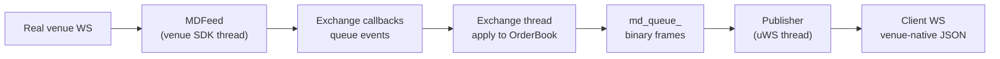

# Market data

Market data flows in one direction: the real venue's WebSocket feed → an `MDFeed` → the exchange
thread, which mutates the book → the internal binary `md_queue_` → the venue's publisher → the
client's WebSocket.

The inbound half is optional. With no feed configured the simulator runs
[self-contained](architecture.md#self-contained-a-conventional-exchange-simulator): the first two
stages below are simply absent, the book is driven purely by client orders, and everything from
`md_queue_` onwards works exactly as described here.



## Feeds

`MDFeed`
([`md_feed.hpp`](https://github.com/SlickQuant/slick-sim/blob/main/src/md_feed/md_feed.hpp))
is a two-method interface — `start()` and `stop()`. Two implementations exist, both live; a
historical replay feed would slot in at the same interface but
[does not exist yet](known-gaps.md#the-historical-data-feed-does-not-exist).

### `CoinbaseLiveWSFeed`

A thin wrapper over `coinbase::WebSocketClient`. On `start()` it subscribes the configured symbols to
the `LEVEL2` and `MARKET_TRADES` channels. Callbacks are delivered to the `CoinbaseExchange` (which
implements `coinbase::UserThreadWebsocketCallbacks`) through a `slick::stream_buffer_multiplexer`
sized by `md_queue_size`; the exchange thread drains it by calling `processData()`.

Every feed also calls `ws_client_->logData("logs/coinbase_data")`, so a raw capture of the upstream
WebSocket stream is written to disk whenever the Coinbase feed is running. This is unconditional and
not configurable.

Config selects it by `"type": "coinbase_live_ws"`, which merely sets `use_live_feed_ = true` — the
actual feed objects are created lazily, one per symbol, in `handleMdSubscription`.

### `HyperliquidLiveWSFeed`

Wraps `hyperliquid::Info` with `user_thread_dispatch = true`, meaning the SDK buffers messages rather
than calling back on its own thread; the exchange thread pumps them with
`getInfo()->dispatch(100)` inside `drainEventQueue()`.

Per coin it opens two subscriptions:

```cpp
info_->subscribe({{"type", "l2"},     {"c", coin}},     …);   // undocumented compressed-diff channel
info_->subscribe({{"type", "trades"}, {"coin", coin}}, …);
```

Note it subscribes upstream to `l2`, not the documented `l2Book` — the compressed diff channel is far
less bandwidth. `addCoin()` allows subscribing more coins after `start()`.

Config selects it by `"type": "hyperliquid_live_ws"`, and unlike Coinbase the feed object is built in
the constructor from the `coins` array, so those coins are subscribed at startup.

Any other `type` value is silently ignored. The
[Alpaca historical feed does not exist](known-gaps.md#the-historical-data-feed-does-not-exist).

## Coinbase: time-ordered event sequencing

Coinbase delivers `l2_data` and `market_trades` on separate channels with independent latency, so
messages can arrive out of order relative to their exchange timestamps. Applying them in arrival
order would corrupt the book. `CoinbaseExchange` therefore buffers and re-orders.

Each symbol gets a `SymbolEventState`:

```cpp
struct SymbolEventState {
    std::priority_queue<Event, std::vector<Event>, EventCompare> pending_events;
    uint64_t last_event_time     = 0;   // newest event_time seen
    uint64_t last_sequence_id    = 0;
    uint64_t last_seq_num        = 0;
    uint64_t next_sequence_id    = 0;   // monotonic tiebreaker
    uint64_t last_published_level_seq_num = 0;
    uint64_t last_published_trade_seq_num = 0;
};
```

`EventCompare` orders by `event_time` ascending, tie-broken by the internal `sequence_id` so events
with identical exchange timestamps keep arrival order.

The WS callbacks (`onLevel2Updates`, `onMarketTrades`) only push into this queue — they never touch
the book. Release happens on the exchange thread in `processSequencedEvents()`, which pops an event
only when one of two conditions holds:

```cpp
// 1. a full second of newer data has arrived, so nothing older can still be in flight
bool safe_by_time_gap = last_event_time > 0 &&
                        top.event_time + ONE_SECOND_NS <= state.last_event_time;
// 2. the event has waited a full second regardless
bool safe_by_timeout  = (now - top.received_time) >= ONE_SECOND_NS;
```

**This buys ordering at the cost of a one-second delay.** Book updates are held for at least a second
before being applied, so the simulated book lags the real market by that much. `processSequencedEvents(true)`
forces an immediate flush but is never called with `force = true` in the current code.

`dispatchEvent` then applies the event. For a level update it either creates a brand-new level
(matching against the opposite side first, in case the new quote crosses a resting simulator order)
or adjusts an existing one via the `getMDLevelQty` delta logic described in
[Order book](order-book.md#why-feed_md_level_quantity_-exists). Stale events — `event_time` older than
`book.lastUpdateTime()` — are logged and dropped.

Level and trade updates are batched into `level_update_buffer_` / `trade_update_buffer_` and flushed
to `md_queue_` when the sequence number changes, so one upstream batch becomes one downstream message.

Snapshots take a different route entirely: `onLevel2Snapshot` runs **on the WS thread** and mutates
the book directly rather than going through the priority queue.

## Hyperliquid: L2 diffs and index resolution

Hyperliquid's undocumented `l2` channel sends compressed incremental diffs:

```json
{ "c": "ETH",
  "l": [ [ {"p": "3000.5", "s": "12.0"} ], [ {"p": "3001.0", "s": "8.5"} ] ],
  "r": [ [2, 5], [0] ],
  "t": 1723300000000 }
```

- `l` — changed or added levels as **absolute** new quantities, `[bids, asks]`.
- `r` — levels removed entirely, given as **indices into the previous per-side ordered price array**,
  not as prices.
- `t` — event time in milliseconds.

Those indices are the problem: to turn index 2 back into a price, you need the exact ordered price
list the venue had before this event. The simulator's own book cannot supply it, because it also
contains your orders and may have levels the real market does not.

So `HyperliquidExchange` keeps a separate mirror:

```cpp
// Symbol* -> (bid prices, ask prices), best-first, real-market only
std::unordered_map<Symbol*, std::array<std::vector<price_t>, 2>> l2_ref_levels_;
```

It is rebuilt from every snapshot (which arrives best-first, so appending preserves order) and
maintained across diffs with `std::lower_bound` insertion using the side-aware `utils::isPriceBetter`
comparator.

`processL2Diff` resolves **all** removal indices against the pre-mutation array before applying any of
them — removing while iterating would shift the later indices. Out-of-range indices are logged and
skipped rather than treated as fatal.

Removals and changes both funnel into `applyPhantomLevelUpdate(symbol, side, price, target_qty, ts)`,
which sets phantom liquidity at one price to exactly `target_qty`:

- **New level** — match against the opposite side first (this price has never been checked for
  crossing), then rest whatever survives.
- **Existing level** — already known non-crossing, so skip matching and just adjust the phantom-only
  quantity toward the target, shrinking from the back and never touching simulator orders.

A removal is simply `target_qty = 0`.

Snapshots (`processL2Snapshot`) call `clearMDOrders()` — preserving resting simulator orders — then
rebuild every level and reset the mirror.

## The internal market-data wire format

`md_queue_` is a `slick::queue<uint8_t>` carrying variable-length frames. All structs are
`#pragma pack(1)` and use the `data[0]` flexible-array-member idiom, so a frame is a header
immediately followed by its payload in the same contiguous reservation.

### Producing a frame

```cpp
auto sz    = sizeof(MarketDataUpdate) + sizeof(MDLevelUpdate) + n * sizeof(MDLevel);
auto index = md_queue_.reserve(sz);
auto* update = reinterpret_cast<MarketDataUpdate*>(md_queue_[index]);
update->type  = MDUpdateType::LEVEL;
update->venue = venue_;
std::memcpy(update->symbol, symbol, sizeof(update->symbol));
auto* payload = reinterpret_cast<MDLevelUpdate*>(update->data);
// … fill payload …
md_queue_.publish(index, sz);
```

Consumers do the mirror: `read(cursor)`, cast to `MarketDataUpdate*`, switch on `type`, cast
`update->data` to the matching payload type.

### Frame header

`MarketDataUpdate` — 34 bytes:

| Offset | Size | Field | Notes |
| --- | --- | --- | --- |
| 0 | 32 | `char symbol[32]` | Not guaranteed NUL-terminated for 32-char symbols |
| 32 | 1 | `Venue venue` | |
| 33 | 1 | `MDUpdateType type` | Selects the payload type |
| 34 | — | `uint8_t data[0]` | Payload begins here |

### Payload by `MDUpdateType`

| `type` | Payload | Produced by | Consumed by |
| --- | --- | --- | --- |
| `BOOK` (0) | `MDBookUpdate` | `publishMDBookUpdate` — never called | Coinbase publisher ignores it |
| `LEVEL` (1) | `MDLevelUpdate` | `publishLevelUpdate` | Coinbase → `l2_data` `"update"` |
| `ORDER` (2) | `MDOrderUpdate` | `publishMDOrderUpdate` — [never called](known-gaps.md#mdupdatetypeorder-is-never-published) | — |
| `TRADE_SUMMARY` (3) | `TradeSummary` | `publishTradeSummary` | Neither publisher handles it |
| `TRADE` (4) | `MDTradeUpdate` | `publishMDTrades` | Hyperliquid → `trades`; [Coinbase drops it](known-gaps.md#the-coinbase-publisher-never-republishes-trades) |
| `BOOK_SNAPSHOT` (5) | `BookSnapshot` | `populateL2Snapshot` | Coinbase → `l2_data` `"snapshot"`; Hyperliquid → `l2Book` / `l2` diff |
| `ORDER_SNAPSHOT` (6) | — | Never produced | — |
| `SUB_RESPONSE` (7) | `MDSubscriptionResponse` + nested payload | `populateL2SubscriptionResponse`, `populateMDTradesResponse`, `rejectMdSubscription` | Both publishers, to deliver the first snapshot |

### Payload structs

```cpp
struct MDLevel {              // 41 bytes
    uint64_t event_time;      //  0  ns
    uint64_t seq_num;         //  8
    price_t  price;           // 16  fixed-point ×1e8
    qty_t    qty;             // 24  fixed-point ×1e8
    uint32_t num_orders;      // 32
    uint16_t level_index;     // 36
    MDUpdateAction update_action;  // 38  NEW / CHANGE / DELETE
    uint8_t  flags;           // 39  UpdateFlags bitmask
    Side     side;            // 40
};

struct MDLevelUpdate { uint64_t event_time; uint32_t num_level_update; MDLevel levels[0]; };
struct BookSnapshot  { uint32_t num_bid; uint32_t num_ask; MDLevel levels[0]; };  // bids then asks

struct MDTrade {              // 34 bytes
    uint64_t event_time; uint64_t seq_num; price_t price; qty_t qty;
    UpdateFlags flags; Side side; };
struct MDTradeUpdate { uint32_t num_trades; MDTrade trades[0]; };

struct MDOrder {              // 41 bytes
    uint64_t order_id; uint64_t event_time; uint64_t priority;
    price_t price; qty_t qty; Side side; };
struct MDOrderUpdate { uint32_t num_orders; MDOrder orders[0]; };

struct MDSubscriptionResponse { uint8_t channel; MDSubscriptionRejectReason reject_reason;
                                uint8_t data[0]; };

struct TradeSummary { time_t timestamp; uint64_t trade_id; int16_t security_id;
                      Side aggressor_side; price_t price; qty_t qty;
                      int32_t num_orders; Trade trades[0]; };
struct Trade { uint64_t order_id; qty_t qty; };
```

`MDBookUpdate` is the one fixed-size payload: `MDLevel sell[10]`, `MDLevel buy[10]`, and
`uint8_t update_index[2]` marking which level changed per side.

!!! note "`price_t` width"
    `price_t` and `qty_t` are `int_fast64_t`, whose size is implementation-defined — 8 bytes on
    x86-64 Linux and Windows, which is what these layouts assume. Because the queue may be backed by
    shared memory, a reader built with a different `int_fast64_t` width would misparse every frame.

### `UpdateFlags`

```cpp
enum UpdateFlags : uint8_t {
    F_NONE        = 0,
    F_IS_SNAPSHOT = 1,        // part of a snapshot rather than an incremental update
    F_END_EVENT   = 1 << 1,   // last message of a batch
};
```

`F_END_EVENT` maps to slick-orderbook's `ChangeFlag::LastInBatch`, set in `Symbol::onPriceLevelUpdate`.

### `MDSubscriptionRejectReason`

`NONE` (0), `UNKNOWN_CONTRACT` (1), `MARKET_CLOSED` (2). `Exchange::rejectMdSubscription` exists and
builds a well-formed frame — but marks the `reason` parameter `[[maybe_unused]]` and never writes it
into `rsp->reject_reason`, so the field is whatever the recycled queue slot held. Nothing calls the
function anyway.

## Publishing

Each publisher runs a uWS event loop and drains `md_queue_` from a private cursor
(`WebsocketMarketDataPublisher::publish_processing`), dispatching each frame to the venue-specific
`publish_market_data_update`. Client subscriptions are tracked per channel and per symbol, so a frame
for an unsubscribed symbol is dropped cheaply.

The wire formats produced are documented per venue:

- [Coinbase market-data channels](integration-coinbase.md#market-data-websocket)
- [Hyperliquid market-data channels](integration-hyperliquid.md#market-data-websocket)

Subscriptions travel in the opposite direction: a client's `subscribe` message causes the publisher to
write a `MD_SUBSCRIPTION` `Request` onto `request_queue_`, which the exchange thread handles by
creating the symbol (if new), attaching a feed, and marking the symbol pending until the first
snapshot arrives. Unsubscribes are written the same way but
[never processed](known-gaps.md#market-data-unsubscribe-requests-are-dropped).
