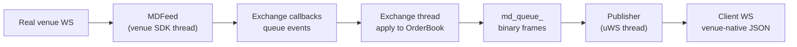

# Market data

Market data flows in one direction: the real venue's WebSocket feed → an `MDFeed` → the exchange
thread, which mutates the book → the internal binary `md_queue_` → the venue's publisher → the
client's WebSocket.

The inbound half is optional. With no feed configured the simulator runs
[self-contained](architecture.md#self-contained-a-conventional-exchange-simulator): the first two
stages below are simply absent, the book is driven purely by client orders, and everything from
`md_queue_` onwards works exactly as described here.



## Feeds

`MDFeed`
([`md_feed.hpp`](https://github.com/SlickQuant/slick-sim/blob/main/src/md_feed/md_feed.hpp))
is a two-method interface — `start()` and `stop()`. Two implementations exist, both live; a
historical replay feed would slot in at the same interface but
[does not exist yet](known-gaps.md#the-historical-data-feed-does-not-exist).

### `CoinbaseLiveWSFeed`

A thin wrapper over `coinbase::WebSocketClient`. On `start()` it subscribes the configured symbols to
the `LEVEL2` and `MARKET_TRADES` channels. Callbacks are delivered to the `CoinbaseExchange` (which
implements `coinbase::UserThreadWebsocketCallbacks`) through a `slick::stream_buffer_multiplexer`
sized by `md_queue_size`; the exchange thread drains it by calling `processData()`.

Every feed also calls `ws_client_->logData("logs/coinbase_data")`, so a raw capture of the upstream
WebSocket stream is written to disk whenever the Coinbase feed is running. This is unconditional and
not configurable.

Config selects it by `"type": "coinbase_live_ws"`, which merely sets `use_live_feed_ = true` — the
actual feed objects are created lazily, one per symbol, in `handleMdSubscription`.

### `HyperliquidLiveWSFeed`

Wraps `hyperliquid::Info` with `user_thread_dispatch = true`, meaning the SDK buffers messages rather
than calling back on its own thread; the exchange thread pumps them with
`getInfo()->dispatch(100)` inside `drainEventQueue()`.

Per coin it opens two subscriptions:

```cpp
info_->subscribe({{"type", "l2"},     {"c", coin}},     …);   // undocumented compressed-diff channel
info_->subscribe({{"type", "trades"}, {"coin", coin}}, …);
```

Note it subscribes upstream to `l2`, not the documented `l2Book` — the compressed diff channel is far
less bandwidth. `addCoin()` allows subscribing more coins after `start()`.

Config selects it by `"type": "hyperliquid_live_ws"`, and unlike Coinbase the feed object is built in
the constructor from the `coins` array, so those coins are subscribed at startup.

Any other `type` value is silently ignored. The
[Alpaca historical feed does not exist](known-gaps.md#the-historical-data-feed-does-not-exist).

## Coinbase: time-ordered event sequencing

Coinbase delivers `l2_data` and `market_trades` on separate channels with independent latency, so
messages can arrive out of order relative to their exchange timestamps. Applying them in arrival
order would corrupt the book. `CoinbaseExchange` therefore buffers and re-orders.

Each symbol gets a `SymbolEventState`:

```cpp
struct SymbolEventState {
    std::priority_queue<Event, std::vector<Event>, EventCompare> pending_events;
    uint64_t last_event_time     = 0;   // newest event_time seen
    uint64_t last_sequence_id    = 0;
    uint64_t last_seq_num        = 0;
    uint64_t next_sequence_id    = 0;   // monotonic tiebreaker
    uint64_t last_published_level_seq_num = 0;
};
```

`EventCompare` orders by `event_time` ascending, then puts a `TRADE` ahead of a `LEVEL_UPDATE` at the
same instant — the two arrive on independent channels, and applying the trade first is what lets the
level update be measured against a book that has already absorbed it.

### The `sequence_id` tie-break looks inverted, and must stay that way

`std::priority_queue` pops the *greatest* element, so `EventCompare` inverts its `event_time`
comparison to get earliest-first. The final `sequence_id` tie-break is **not** inverted, which reads
like an oversight. It is load-bearing: `sequence_id` is assigned as each event is enqueued, and the
two enqueue loops walk their batch in opposite directions to suit each channel's own ordering.

| Callback | Iterates the batch | Because the venue sends | Popping highest `sequence_id` first gives |
| --- | --- | --- | --- |
| `onLevel2Updates` | **reverse** (`rbegin`→`rend`) | level updates oldest-first | array order |
| `onMarketTrades` | **forward** | `market_trades` newest-first | reverse array order |

Both land on chronological. "Fixing" the tie-break to match the `event_time` inversion replays both
batches backwards — levels settle on a stale quantity, and trades match against the book and take
their public trade ids in reverse.

!!! note "Same-price, same-timestamp updates in one batch"
    The underlying `slick-orderbook` rejects a level mutation whose timestamp is not newer than that
    level's last update, so a second update to the *same* price at the *same* instant is silently
    dropped. Coinbase sends at most one entry per price per batch, so this does not arise in
    practice — but it does mean same-instant ordering at one price is unobservable in the book.

The callbacks (`onLevel2Updates`, `onMarketTrades`) only push into this queue — they never touch the
book. They already run on the exchange thread, delivered by `processData()`, so this is buffering for
**ordering**, not for thread safety. Release happens later in the same loop iteration, in
`processSequencedEvents()`, which pops an event only when one of two conditions holds:

```cpp
// 1. a full second of newer data has arrived, so nothing older can still be in flight
bool safe_by_time_gap = last_event_time > 0 &&
                        top.event_time + ONE_SECOND_NS <= state.last_event_time;
// 2. the event has waited a full second regardless
bool safe_by_timeout  = (now - top.received_time) >= ONE_SECOND_NS;
```

**This buys ordering at the cost of a one-second delay.** Book updates are held for at least a second
before being applied, so the simulated book lags the real market by that much. `processSequencedEvents(true)`
forces an immediate flush but is never called with `force = true` in the current code.

`dispatchEvent` then applies the event. For a level update it either creates a brand-new level
(matching against the opposite side first, in case the new quote crosses a resting simulator order)
or adjusts an existing one via the `getMDLevelQty` delta logic described in
[Order book](order-book.md#why-feed_md_level_quantity_-exists). Stale events — `event_time` older than
`book.lastUpdateTime()` — are logged and dropped.

Level updates are batched into `level_update_buffer_` and flushed to `md_queue_` when the sequence
number changes, so one upstream batch becomes one downstream message. Trade events are not batched:
each is [matched immediately](#venue-trade-prints-are-matched-not-relayed) and its fills published as
they occur.

The quantity buffered is **what the level ended up holding** — `total_quantity`, read back from the
book after the update has been applied — not the venue's raw `event.qty`. The two diverge for two
independent reasons:

- The book may decline to take the update at face value. `reconcilePhantomQty` lowers a stale
  update's target by the quantity a trade already removed, and a brand-new level rests only what
  survived matching.
- `total_quantity` includes the simulator's own resting orders. A real venue's L2 shows your orders
  too, so a client trading against the simulator should see them in the book it publishes.

Publishing `event.qty` instead would leave a client's incrementally-maintained book disagreeing with
the simulator's own — rebuilding liquidity the simulator will not honour, and omitting the client's
own resting size.

All three producers of level data therefore agree on one basis: this path,
`Symbol::onPriceLevelUpdate` (which forwards the book's own level quantity for order-driven changes),
and `populateL2Snapshot`. A client can re-read a snapshot at any time and find it consistent with the
deltas it has been applying.

Snapshots take a different route: `onLevel2Snapshot` mutates the book directly rather than going
through the priority queue — safe to do, since it is on the exchange thread like everything else, and
correct because a snapshot is authoritative and supersedes anything still queued.

## Hyperliquid: L2 diffs and index resolution

Hyperliquid's undocumented `l2` channel sends compressed incremental diffs:

```json
{ "c": "ETH",
  "l": [ [ {"p": "3000.5", "s": "12.0"} ], [ {"p": "3001.0", "s": "8.5"} ] ],
  "r": [ [2, 5], [0] ],
  "t": 1723300000000 }
```

- `l` — changed or added levels as **absolute** new quantities, `[bids, asks]`.
- `r` — levels removed entirely, given as **indices into the previous per-side ordered price array**,
  not as prices.
- `t` — event time in milliseconds.

Those indices are the problem: to turn index 2 back into a price, you need the exact ordered price
list the venue had before this event. The simulator's own book cannot supply it, because it also
contains your orders and may have levels the real market does not.

So `HyperliquidExchange` keeps a separate mirror:

```cpp
// Symbol* -> (bid prices, ask prices), best-first, real-market only
std::unordered_map<Symbol*, std::array<std::vector<price_t>, 2>> l2_ref_levels_;
```

It is rebuilt from every snapshot (which arrives best-first, so appending preserves order) and
maintained across diffs with `std::lower_bound` insertion using the side-aware `utils::isPriceBetter`
comparator.

`processL2Diff` resolves **all** removal indices against the pre-mutation array before applying any of
them — removing while iterating would shift the later indices. Out-of-range indices are logged and
skipped rather than treated as fatal.

Removals and changes both funnel into `applyPhantomLevelUpdate(symbol, side, price, target_qty, ts)`,
which sets phantom liquidity at one price to exactly `target_qty`:

- **New level** — match against the opposite side first (this price has never been checked for
  crossing), then rest whatever survives.
- **Existing level** — already known non-crossing, so skip matching and just adjust the phantom-only
  quantity toward the target, shrinking from the back and never touching simulator orders.

A removal is simply `target_qty = 0`.

Snapshots (`processL2Snapshot`) call `clearMDOrders()` — preserving resting simulator orders — then
rebuild every level and reset the mirror.

## Venue trade prints are matched, not relayed

A trade message from the venue is never forwarded to clients as-is. It is replayed into the book as
an incoming aggressor order — same side as the real taker, the print price as its limit — so it takes
liquidity exactly as the real trade did, filling any simulator order that was ahead of the phantom
liquidity it swept. Only the fills that result are published, as `TRADE_SUMMARY`.

Anything the print could not fill rests, with the same order id, on the aggressor's own side. It
cannot cross at that moment: a remainder only exists because nothing was still crossable at that
limit. When the venue later reports opposing liquidity at or through that price, the new-level path
matches it against the book before resting it, so the leftover is consumed there.

### Not reducing the same quantity twice

The venue also sends a level update for the trade it just printed. Applying both the trade and that
update would remove the same quantity from the level twice.

In the ordinary case no correction is needed: the level update carries the post-trade quantity, the
book has already absorbed the trade, and the two agree. Two things keep it that way:

- **Ordering.** A print and its level update share a timestamp but arrive on independent channels, so
  arrival order between them is arbitrary. `CoinbaseExchange::EventCompare` breaks timestamp ties by
  putting `TRADE` before `LEVEL_UPDATE`, so the book absorbs the trade first.
- **A credit, for updates that predate the trade.** When a trade consumes phantom liquidity,
  `Symbol::creditTradedQty` records the amount at that (side, price) with the trade's timestamp — the
  *resting* side, which is the opposite of the aggressor's, and one entry per price level swept.
  `Exchange::reconcilePhantomQty` then offsets a level update stamped **strictly before** the trade,
  since that update still reports the pre-trade quantity. Timestamps that tie count as reflecting the
  trade.

Only phantom quantity is credited (`TradeSummaryInfo::phantom_qty`), never the print size: when a
trade fills the simulator's own resting order, the venue's level still legitimately drops, because
that liquidity really did trade at the venue.

Credits are held **per trade timestamp and resolved individually**, never summed into one figure.
A level update reflects only the trades that preceded it, so an update landing between two trades at
the same price must offset by the later one alone — collapsing them would subtract the earlier trade
a second time and under-report the level until the next update resynced it. `takeTradedQty(side,
price, as_of)` therefore returns only the credits `as_of` predates, and drops the ones it reflects.
Dropping them is what stops stale credit from surviving to swallow a later, genuine cancel; keeping
the rest is what lets a subsequent update resolve them correctly.

## The internal market-data wire format

`md_queue_` is a `slick::queue<uint8_t>` carrying variable-length frames. All structs are
`#pragma pack(1)` and use the `data[0]` flexible-array-member idiom, so a frame is a header
immediately followed by its payload in the same contiguous reservation.

### Producing a frame

```cpp
auto sz    = sizeof(MarketDataUpdate) + sizeof(MDLevelUpdate) + n * sizeof(MDLevel);
auto index = md_queue_.reserve(sz);
auto* update = reinterpret_cast<MarketDataUpdate*>(md_queue_[index]);
update->type  = MDUpdateType::LEVEL;
update->venue = venue_;
std::memcpy(update->symbol, symbol.data(), sizeof(update->symbol));   // symbol is a symbol_name_t
auto* payload = reinterpret_cast<MDLevelUpdate*>(update->data);
// … fill payload …
md_queue_.publish(index, sz);
```

Consumers do the mirror: `read(cursor)`, cast to `MarketDataUpdate*`, switch on `type`, cast
`update->data` to the matching payload type.

### Frame header

`MarketDataUpdate` — 34 bytes:

| Offset | Size | Field | Notes |
| --- | --- | --- | --- |
| 0 | 32 | `char symbol[32]` | Not guaranteed NUL-terminated for 32-char symbols |
| 32 | 1 | `Venue venue` | |
| 33 | 1 | `MDUpdateType type` | Selects the payload type |
| 34 | — | `uint8_t data[0]` | Payload begins here |

`Symbol` and `OrderBook` both hold their name as `symbol_name_t`, declared next to this struct as
`utils::fixed_string<sizeof(MarketDataUpdate::symbol)>`. Producers therefore copy the whole field as
a fixed block. The type is derived from the wire field on purpose: widening `symbol[32]` widens the
storage with it, rather than leaving every publish site reading `sizeof(update->symbol)` bytes out of
a narrower buffer.

### Payload by `MDUpdateType`

| `type` | Payload | Produced by | Consumed by |
| --- | --- | --- | --- |
| `BOOK` (0) | `MDBookUpdate` | `publishMDBookUpdate` — never called | Coinbase publisher ignores it |
| `LEVEL` (1) | `MDLevelUpdate` | `publishLevelUpdate` | Coinbase → `l2_data` `"update"` |
| `ORDER` (2) | `MDOrderUpdate` | `publishMDOrderUpdate` — [never called](known-gaps.md#mdupdatetypeorder-is-never-published) | — |
| `TRADE_SUMMARY` (3) | `TradeSummary` | `publishTradeSummary` | Coinbase → `market_trades` `"update"`; Hyperliquid → `trades` |
| `TRADE` (4) | `MDTradeUpdate` | Reserved — nothing produces it | — |
| `BOOK_SNAPSHOT` (5) | `BookSnapshot` | `populateL2Snapshot` | Coinbase → `l2_data` `"snapshot"`; Hyperliquid → `l2Book` / `l2` diff |
| `ORDER_SNAPSHOT` (6) | — | Never produced | — |
| `SUB_RESPONSE` (7) | `MDSubscriptionResponse` + nested payload | `populateL2SubscriptionResponse`, `publishTradeSubscriptionResponse`, `rejectMdSubscription` | Both publishers, to deliver the first snapshot |

`TRADE_SUMMARY` is the sole source of the public trade tape. A venue's own trade print is not
relayed: it is replayed through the matching engine as an aggressor order, and the fills it produces
are published as `TRADE_SUMMARY`. `MDUpdateType::TRADE` is kept only so the enumerator values after
it do not shift.

### Payload structs

```cpp
struct MDLevel {              // 41 bytes
    uint64_t event_time;      //  0  ns
    uint64_t seq_num;         //  8
    price_t  price;           // 16  fixed-point ×1e8
    qty_t    qty;             // 24  fixed-point ×1e8
    uint32_t num_orders;      // 32
    uint16_t level_index;     // 36
    MDUpdateAction update_action;  // 38  NEW / CHANGE / DELETE
    uint8_t  flags;           // 39  UpdateFlags bitmask
    Side     side;            // 40
};

struct MDLevelUpdate { uint64_t event_time; uint32_t num_level_update; MDLevel levels[0]; };
struct BookSnapshot  { uint32_t num_bid; uint32_t num_ask; MDLevel levels[0]; };  // bids then asks

struct MDTrade {              // 42 bytes
    uint64_t trade_id;        //  0  per-venue public sequence
    uint64_t event_time; uint64_t seq_num; price_t price; qty_t qty;
    UpdateFlags flags; Side side; };
struct MDTradeUpdate { uint32_t num_trades; MDTrade trades[0]; };

// Payload of a SUB_RESPONSE on a trade channel. Trades the subscriber's book
// snapshot reflects are history; the rest are delivered as a normal update.
struct MDTradeSnapshotResponse { uint32_t num_snapshot; uint32_t num_update;
                                 MDTrade trades[0]; };  // two contiguous blocks

struct MDOrder {              // 41 bytes
    uint64_t order_id; uint64_t event_time; uint64_t priority;
    price_t price; qty_t qty; Side side; };
struct MDOrderUpdate { uint32_t num_orders; MDOrder orders[0]; };

struct MDSubscriptionResponse { uint8_t channel; MDSubscriptionRejectReason reject_reason;
                                uint8_t data[0]; };

struct TradeSummary { time_t timestamp; uint64_t trade_id; int16_t security_id;
                      Side aggressor_side; price_t price; qty_t qty;
                      int32_t num_orders; Trade trades[0]; };
struct Trade { uint64_t order_id; qty_t qty; };
```

`MDBookUpdate` is the one fixed-size payload: `MDLevel sell[10]`, `MDLevel buy[10]`, and
`uint8_t update_index[2]` marking which level changed per side.

!!! note "`price_t` width"
    `price_t` and `qty_t` are `int_fast64_t`, whose size is implementation-defined — 8 bytes on
    x86-64 Linux and Windows, which is what these layouts assume. Because the queue may be backed by
    shared memory, a reader built with a different `int_fast64_t` width would misparse every frame.

### `UpdateFlags`

```cpp
enum UpdateFlags : uint8_t {
    F_NONE        = 0,
    F_IS_SNAPSHOT = 1,        // part of a snapshot rather than an incremental update
    F_END_EVENT   = 1 << 1,   // last message of a batch
    F_NOT_IN_BOOK = 1 << 2,   // MDTrade only: this print was never applied to the book
};
```

`F_END_EVENT` maps to slick-orderbook's `ChangeFlag::LastInBatch`, set in `Symbol::onPriceLevelUpdate`.

`F_NOT_IN_BOOK` is set only on trades seeded from a venue's own trade snapshot, and is what
[splits the subscribe-time trade snapshot](#the-recent-trade-snapshot).

### `MDSubscriptionRejectReason`

`NONE` (0), `UNKNOWN_CONTRACT` (1), `MARKET_CLOSED` (2). `Exchange::rejectMdSubscription` exists and
builds a well-formed frame — but marks the `reason` parameter `[[maybe_unused]]` and never writes it
into `rsp->reject_reason`, so the field is whatever the recycled queue slot held. Nothing calls the
function anyway.

## Publishing

Each publisher runs a uWS event loop and drains `md_queue_` from a private cursor
(`WebsocketMarketDataPublisher::publish_processing`), dispatching each frame to the venue-specific
`publish_market_data_update`. Client subscriptions are tracked per channel and per symbol, so a frame
for an unsubscribed symbol is dropped cheaply.

`publish_processing` drains up to 1000 frames per pass before handing the loop back, so a flood costs
one `loop_->defer` per batch rather than per frame; a `SUB_RESPONSE` or `BOOK_SNAPSHOT` cuts the batch
short, since a whole book is far more expensive to encode than an incremental update.

!!! warning "The reschedule must stay unconditional"
    `publish_processing` re-arms itself via `schedule_publish_processing()` even when the queue came
    up empty, and that is deliberate. The `defer` it posts is the *only* thing that runs the function
    again: `md_queue_` is a lock-free queue with no wakeup mechanism, and the exchange thread that
    fills it never touches the publisher's loop. Skipping the reschedule when the queue is empty
    looks like an easy saving and stops the publisher permanently the first time it catches up.

The wire formats produced are documented per venue:

- [Coinbase market-data channels](integration-coinbase.md#market-data-websocket)
- [Hyperliquid market-data channels](integration-hyperliquid.md#market-data-websocket)

Subscriptions travel in the opposite direction: a client's `subscribe` message causes the publisher to
write a `MD_SUBSCRIPTION` `Request` onto `request_queue_`, which the exchange thread handles by
creating the symbol (if new), attaching a feed, and marking the symbol pending until the first
snapshot arrives. Unsubscribes are written the same way and dispatched to `handleMdUnsubscription`.

### The recent-trade snapshot

Every trade published on a tape is also recorded in `Symbol::trade_history_`, a bounded per-symbol
ring buffer. `Exchange::publishTradeSummary` is the single choke point, so the history and the live
tape can never diverge — and both carry the same trade id.

When a client subscribes to a trade channel, `Exchange::publishTradeSubscriptionResponse` frames that
history as an `MDTradeSnapshotResponse`, split by whether the book the subscriber is about to receive
already contains each trade:

- **`num_snapshot`** — trades the book absorbed. Genuine history, consistent with that book snapshot.
- **`num_update`** — trades it did not. Presenting these as settled history would misrepresent them,
  so the publisher sends them as a normal trade update immediately after the snapshot instead.

The test is `F_NOT_IN_BOOK`, not a timestamp. A trade the matching engine produced is in the book by
construction — it was applied when it arrived, and the L2 snapshot is generated from that same book —
so it is history whatever its timestamp. Only prints seeded from a venue's own trade snapshot were
never applied, and for those the question is whether the book's data reaches their timestamp, which
is where `order_book_->lastUpdateTime()` comes in.

!!! warning "`lastUpdateTime()` alone is not the boundary"
    It tracks **level updates only** — the trade handlers mutate the book without advancing it. Using
    it on its own would classify an already-applied trade as `num_update`, telling the subscriber a
    trade was still to come while handing them a book snapshot that already reflected it.

Because the test is not a timestamp, it is **not monotonic over the history**: an applied trade can
sit after an unapplied print that is newer than the book. The builder therefore partitions — one pass
copying the snapshot block, a second copying the update block — instead of copying in history order
and counting as it goes. Copying in history order would leave the two blocks interleaved while the
counts said otherwise, so the consumer, which reads each block as a contiguous range, would read one
block's trades as the other's. Each pass walks the history in order, so both blocks stay
chronological within themselves.

Both blocks travel in one SUB_RESPONSE frame deliberately. `publish_subscription_response` is the only
publisher path that targets just the newly-subscribed sockets — it filters on each socket's pending
set — so emitting the newer trades as a separate frame would broadcast them to every existing
subscriber that already saw them live.

So the update block is always empty for simulator-generated trades. It earns its keep when shadowing
a live feed, where Coinbase's upstream `market_trades` snapshot arrives on its own schedule and can
carry prints newer than the level2 snapshot the simulator currently holds. Those upstream prints seed
the history only — they are never fed to the matching engine, having happened before the simulator
was listening, and they are the only trades that carry `F_NOT_IN_BOOK`.
