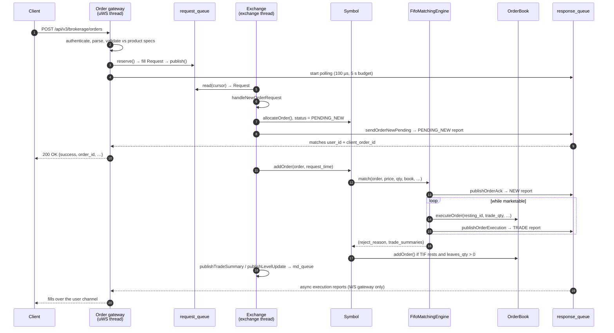

# Order lifecycle

This page follows a single order from the moment it arrives at a gateway to the moment the client
sees a fill, then documents every enum and struct involved.

## The happy path, end to end



Two things about this flow are unusual and worth stating plainly.

**The REST response is the `PENDING_NEW` report, not the fill.** The gateway's polling loop breaks on
the *first* response matching its `user_id` + `client_order_id`, which is always the `PENDING_NEW`
report emitted by `sendOrderNewPending` before matching even starts. The HTTP call returns
`success: true` with an `order_id`; subsequent acks, fills and cancels arrive only over the WebSocket
order-entry channel. A REST-only client learns nothing about fills.

**The gateway thread blocks while polling.** For the 5 s budget (or until a response matches), that
gateway's uWS event loop is not serving anyone else.

## Request path in detail

### 1. Gateway to `Request`

Each gateway translates its venue's wire format into the internal
[`Request`](https://github.com/SlickTech/exchange_simulator/blob/main/src/common/messages.hpp#L264-L279),
a packed struct with a union payload:

```cpp
struct Request {
    time_t       time_stamp;   // ns, set by the gateway
    char         symbol[32];
    MessageType  msg_type;
    union {
        AddOrderMessage       add_order;
        ModifyOrderMessage    modify_order;
        CancelOrderMessage    cancel_order;
        MDSubscriptionMessage md_subscription;
    };
};
```

`time_stamp` matters beyond logging: the cancel and edit handlers correlate responses by matching
`OrderResponse::request_time` against the `Request::time_stamp` they published.

The fixed-size char arrays are hard limits. `client_order_id` and `order_id` are 37 bytes (a UUID
plus NUL); `symbol` is 32. The Coinbase gateway truncates and logs a warning when a `client_order_id`
overflows.

### 2. Exchange dispatch

`Exchange::processRequest` reads one request per call and switches on `msg_type`:

| `MessageType` | Handler |
| --- | --- |
| `NEW_ORDER_SINGLE` | `handleNewOrderRequest` |
| `ORDER_REPLACE_REQUEST` | `handleModifyOrderRequest` |
| `ORDER_CANCEL_REQUEST` | `handleCancelOrderRequest` |
| `MD_SUBSCRIPTION` | `handleMdSubscription` (virtual, per-adapter) |
| `MD_UNSUBSCRIPTION` | **not handled** — see [Known gaps](known-gaps.md#market-data-unsubscribe-requests-are-dropped) |

### 3. New order

[`handleNewOrderRequest`](https://github.com/SlickTech/exchange_simulator/blob/main/src/exchange/exchange.cpp#L95-L149):

1. Look up the `Symbol` by name; reject with `UNKNOWN_CONTRACT` if absent. A symbol only exists once
   something has subscribed to its market data, so **orders for an instrument nobody has subscribed
   to are always rejected**.
2. If `client_order_id` is non-empty and already maps to a live order, reject with
   `CLIENT_ORDER_ID_ALREADY_EXISTS`.
3. `allocateOrder()` from the book's object pool — this assigns a fresh `uint64_t id`, a random UUID
   `order_id`, and `created_time`.
4. Copy the request fields in, set `status = PENDING_NEW`, and send the pending-new report.
5. `Symbol::addOrder(order, request_time)`, which runs the matching engine and, if anything is left
   and the TIF permits, rests the remainder on the book.
6. Publish any trade summaries and cached level updates to `md_queue_`.
7. Reject if the engine returned a reason **other than** `FOK_CANNOT_FILL` — an unfillable FOK has
   already been cancelled, so turning it into a reject too would double-report.

### 4. Modify

`handleModifyOrderRequest` looks up the order by `client_order_id` if present, otherwise by
`order_id`; rejects with `UNKNOWN_ORDER` if neither finds it. It sets `PENDING_REPLACE`, sends the
pending-replace report, then calls `Symbol::modifyOrder`, which re-enters the matching engine with
the new price and quantity. See
[Matching engine](matching-engine.md#modifies-re-enter-the-matching-loop) for what happens to queue
priority.

### 5. Cancel

`handleCancelOrderRequest` resolves the order the same way, sets `PENDING_CANCEL`, sends the
pending-cancel report, then `Symbol::cancelOrder` deletes it from the book, publishes the cancel
report, and returns the `Order` to the pool.

!!! note "Successful cancels are indistinguishable from silence"
    `Symbol::cancelOrder` publishes a cancel report via `publishOrderCancel`, but the Coinbase REST
    gateway's `batch_cancel` correlates only on `request_time` and treats *no matching response
    within 200 ms* as success. Its comment claims "successful cancels don't generate responses",
    which is not quite what the code does — the report simply may not arrive inside the window.

## Response path

Everything the client hears comes back as an
[`OrderResponse`](https://github.com/SlickTech/exchange_simulator/blob/main/src/common/messages.hpp#L281-L305)
on `response_queue_`. There are two families of producer:

**Pending reports**, sent by `Exchange` before the engine runs:

| Function | `exec_type` | `order_status` |
| --- | --- | --- |
| `sendOrderNewPending` | `NEW` | `PENDING_NEW` |
| `sendOrderReplacePending` | `PENDING_REPLACE` | `PENDING_REPLACE` |
| `sendOrderCancelPending` | `PENDING_CANCEL` | `PENDING_CANCEL` |

**Lifecycle reports**, sent by the matching engine:

| Function | Emitted when |
| --- | --- |
| `publishOrderAck` | Order accepted, at the top of `match()` when status is `PENDING_NEW` |
| `publishOrderExecution` | Each individual fill |
| `publishOrderModify` | A `PENDING_REPLACE` order's price/quantity has been applied |
| `publishOrderCancel` | Explicit cancel, IOC remainder, unfillable FOK, SMP `CANCEL_NEWEST`, or a modify that zeroed the quantity |

**Rejects**, sent by `Exchange::rejectNewOrderRequest` / `rejectModifyOrderRequest` /
`rejectCancelOrderRequest`, all with `response_type = REJECT`, `exec_type = REJECTED`,
`order_status = REJECTED`, and a populated `reject_reason`.

!!! warning "The reject helpers always read `request.add_order`"
    `rejectModifyOrderRequest` and `rejectCancelOrderRequest` copy `user_id`, `client_order_id`,
    `price` and `qty` from `request.add_order`, even though the active union member is
    `modify_order` or `cancel_order`. Because `Request` is a packed union the read is not a crash,
    but the fields are reinterpreted from a different layout, so the identifiers and prices on a
    modify/cancel reject are garbage. Correlate those by `request_time` instead.

## Reference: the `Order` struct

[`src/common/order.hpp`](https://github.com/SlickTech/exchange_simulator/blob/main/src/common/order.hpp#L253-L321).
The fields that carry meaning beyond their names:

| Field | Meaning |
| --- | --- |
| `id` | `uint64_t`, from the process-global `utils::nextOrderId()`. The book's primary key, and what the L3 book stores |
| `order_id` | Random UUID string, generated in `allocateOrder()`. What the client sees as the exchange order id |
| `client_order_id` | Client-supplied. Indexed separately; lookups prefer it over `order_id` |
| `priority` | Queue position from the global `nextOrderPriority()` counter. **Reset on a price change** |
| `quantity` | Original order quantity |
| `leaves_quantity` | Unfilled remainder. Reaching 0 removes the order from the book's indices |
| `cum_quantity` | Filled to date |
| `client_id` | `int`, default **-1**. Self-match prevention is skipped entirely when either side is -1, and nothing in the current code ever assigns it, so **SMP is effectively inert in production** |
| `size_in_quote` | Declared for quote-denominated sizing; never read |
| `post_only` | Parsed from Coinbase `limit_limit_gtc.post_only` and echoed back in reports, but **never enforced** by the matching engine |
| `edit_history` | A `json::array()` on every order; never appended to |

Quantities and prices are fixed-point `int_fast64_t` scaled by 1e8 — see
[Matching engine](matching-engine.md#fixed-point-arithmetic). The `*_double()` accessors convert back.

## Reference: enums

All from [`src/common/order.hpp`](https://github.com/SlickTech/exchange_simulator/blob/main/src/common/order.hpp)
and [`src/common/messages.hpp`](https://github.com/SlickTech/exchange_simulator/blob/main/src/common/messages.hpp).
Character values follow FIX conventions.

### `Side`

`BUY` (0), `SELL` (1), `UNKNOWN_SIDE` (2). The numeric values matter: `to_book_side()` is a straight
`static_cast` onto `slick::orderbook::Side`, and the publishers test `side ? "offer" : "bid"`.

### `OrderType`

| Value | Char | Reachable? |
| --- | --- | --- |
| `UNKNOWN` | `0` | — |
| `MARKET` | `1` | Yes — Coinbase `market_market_ioc`, `market_market_fok` |
| `LIMIT` | `2` | Yes — Coinbase `limit_limit_gtc`, `sor_limit_ioc`; all Hyperliquid orders |
| `STOP`, `STOP_LIMIT`, `BRACKET`, `TWAP`, `ROLL_OPEN`, `ROLL_CLOSE`, `LIQUIDATION`, `SCALED` | `3`–`9`, `A` | Declared only; no gateway produces them and the engine has no handling |

A market order is represented by `price == NULL_PRICE`, which the matching loop treats as "match at
any price".

### `TimeInForce`

| Value | Char | Engine behaviour |
| --- | --- | --- |
| `DAY` | `0` | Rests on the book |
| `GOOD_TILL_CANCEL` | `1` | Rests on the book |
| `AT_THE_OPENING` | `2` | Not marketable-rested; falls through the `should_rest` check and is dropped |
| `IMMEDIATE_OR_CANCEL` | `3` | Matches, then cancels any remainder |
| `FILL_OR_KILL` | `4` | Pre-checked; cancelled outright if it cannot fill completely |
| `GOOD_TILL_CROSSING` | `5` | Same as `AT_THE_OPENING` — not rested |
| `GOOD_TILL_DATE` | `6` | Rests on the book. `AddOrderMessage::expire_time` exists but no expiry is ever enforced |

### `ExecType` and `OrderStatus`

`ExecType`: `NEW` `0`, `CANCELED` `4`, `REPLACED` `5`, `PENDING_CANCEL` `6`, `REJECTED` `8`,
`EXPIRED` `C`, `PENDING_REPLACE` `E`, `TRADE` `F`, `TRADE_CORRECT` `G`, `TRADE_CANCEL` `H`,
`ORDER_STATUS` `I`, `RESTATED` `D`.

`OrderStatus`: `NEW` `0`, `PARTIALLY_FILLED` `1`, `FILLED` `2`, `DONE_FOR_DAY` `3`, `CANCELED` `4`,
`REPLACED` `5`, `PENDING_CANCEL` `6`, `STOPPED` `7`, `REJECTED` `8`, `SUSPENDED` `9`, `PENDING_NEW`
`A`, `CALCULATED` `B`, `EXPIRED` `C`, `ACCEPTED_FOR_BIDDING` `D`, `PENDING_REPLACE` `E`.

Only a subset is ever produced: `PENDING_NEW`, `NEW`, `PARTIALLY_FILLED`, `FILLED`, `PENDING_REPLACE`,
`REPLACED`, `PENDING_CANCEL`, `CANCELED`, `REJECTED`.

### `OrdRejectReason`

Twenty-two values are declared. These are the ones actually raised:

| Reason | Raised by |
| --- | --- |
| `UNKNOWN_CONTRACT` | `handleNewOrderRequest` / `handleModifyOrderRequest` / `handleCancelOrderRequest` when `SymbolManager` has no such symbol |
| `UNKNOWN_ORDER` | Modify or cancel where neither `client_order_id` nor `order_id` resolves |
| `CLIENT_ORDER_ID_ALREADY_EXISTS` | New order whose `client_order_id` is already live |
| `SMP` | `FifoMatchingEngine` under `CANCEL_NEWEST` when a self-match is detected |
| `FOK_CANNOT_FILL` | FOK pre-check failure. Returned to `Symbol` but deliberately *not* turned into a client reject |

The remaining values — `MARKET_CLOSED`, `MARKET_HALTED`, `INVALID_TICK_SIZE`, `INVALID_QTY`,
`FAK_MUST_BE_LIMIT`, the iceberg and stop-price reasons, and so on — are declared and stringified but
never raised. Tick-size and minimum-quantity checks do exist, but they live in the Coinbase REST
gateway (`validate_order`) and return HTTP 400 with Coinbase's own error strings rather than an
`OrdRejectReason`.

### `CxlRejectReason`, `BusinessRejectReason`, `SessionRejectReason`

Declared in `messages.hpp` with `to_string` helpers. Nothing in the current code produces any of
them — `OrderResponse` has no field of these types. They belong to the unused FIX/TCP gateway.

### `SelfMatchPreventionMode`

`NONE` (0), `CANCEL_RESTING` (1), `CANCEL_NEWEST` (2). Stored per-`Symbol` in `smp_mode_`, which is
initialised to `NONE` and never assigned outside tests. See
[Matching engine](matching-engine.md#self-match-prevention).
